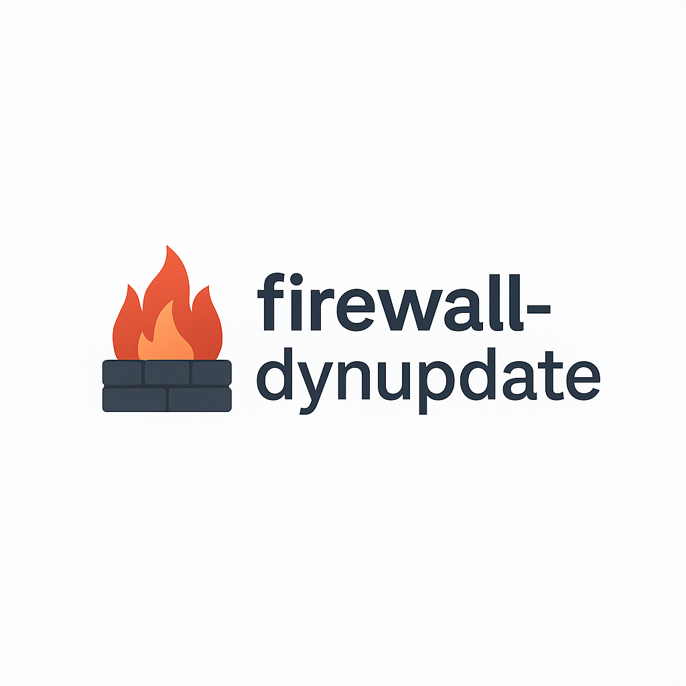

# Firewall DynDNS Whitelist Automation

Willkommen zur offiziellen Dokumentation des Projekts **firewall-dynupdate** 🎯

<p align="center">
  
</p>

> [Zurück zum Repository ←](https://github.com/EinsVier/firewall-dynupdate)

Dieses Tool erlaubt dir, automatisch dynamisch aufgelöste IPs (z. B. von DynDNS-Hosts) in deine `firewalld`-Konfiguration aufzunehmen – ideal für Heimserver, NAS, VPS, Container und alles dazwischen.

## ✨ Features

- Bash-Skript für dynamische Whitelist-Pflege
- Automatische DNS-Auflösung + Vergleich mit bisherigen IPs
- Aktualisierung von `firewalld rich rules`
- systemd-Timer für zyklisches Update
- Logging + Logrotate-Unterstützung
- Konfiguration per `.env`
- GitHub Actions mit ShellCheck (CI)

## ⚡ Schnellstart

```bash
# Skript nach /usr/local/bin kopieren
sudo cp scripts/update_firewall.sh /usr/local/bin/update_firewall.sh
sudo chmod +x /usr/local/bin/update_firewall.sh

# .env anpassen
cp .env.example .env
nano .env

# systemd aktivieren
sudo cp systemd/*.service systemd/*.timer /etc/systemd/system/
sudo systemctl daemon-reload
sudo systemctl enable --now update-firewall.timer
```


## 📚 Dokumentation

Hier findest du die wichtigsten Anleitungen und Infos:

- [Installation](./installation.md)
- [Verwendung](./usage.md)
- [Beispielkonfiguration](./.env.example)
- [FAQ & Troubleshooting](./faq.md)

## Lizenz

MIT License – nutze, erweitere, teile! 😄

> [Zurück zum Repository ←](https://github.com/EinsVier/firewall-dynupdate)
